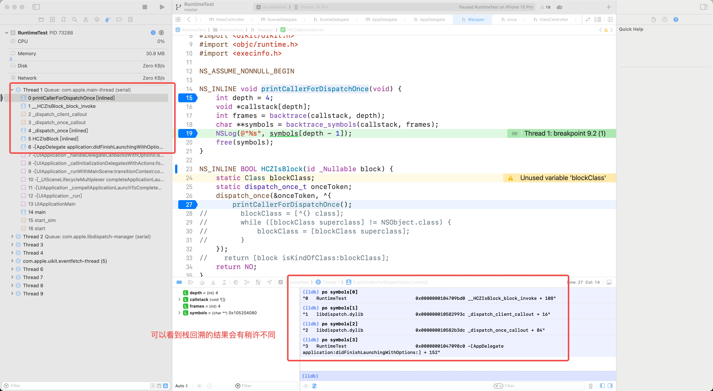
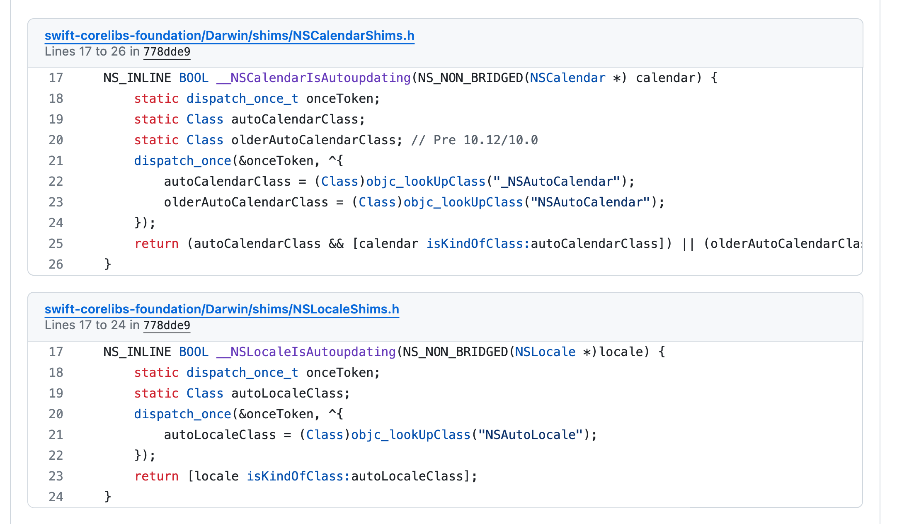
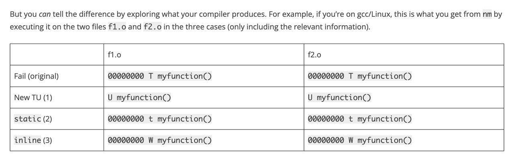

# __inline__ 是否会改变 local static variable 的行为？
> TLDR：
> 1. 介绍了为什么不能将 ``__inline__`` 的作用理解为 宏展开。
> 2. ``__inline__`` 并不会改变 局部 static 变量原本的行为，因为编译器将最终决定是否进行 inline ，编译器自然应该抹平区别。当然你如果还添加了 ``__attribute__((always_inline))``  就一定会内联。
> 3. 尽量不要在 .h 中声明 static 函数（包括 NS_INLINE 函数），除非你很清楚你在做什么。

## 疑问出现
问题最早是最近在看公司内某个 DI 库 ，学到了非常多有趣的设计与设计理念，但同时也遇到了一些疑问，例如这个 XXXIsBlock 。
```oc
// XXXServiceKitDefines.h
NS_INLINE BOOL XXXIsBlock(id _Nullable block) {
    static Class blockClass;
    static dispatch_once_t onceToken;
    dispatch_once(&onceToken, ^{
        blockClass = [^{} class];
        while ([blockClass superclass] != NSObject.class) {
            blockClass = [blockClass superclass];
        }
    });
    return [block isKindOfClass:blockClass];
}
```
函数逻辑很简单，判断传入的参数是否是 ``blockClass``，其中获取 ``blockClass`` 的逻辑只需要执行一次。

这同时还是一个 Inline 的函数，我们知道在正常情况下，标注了 NS_INLINE 的函数，还会默认带有 static 的属性。而我一直将 NS_INLINE 的行为按宏定义理解。
```oc
#if !defined(NS_INLINE)
    #if defined(__GNUC__)
        #define NS_INLINE static __inline__ __attribute__((always_inline)) // 走的这一行
    #elif defined(__MWERKS__) || defined(__cplusplus)
        #define NS_INLINE static inline
    #elif defined(_MSC_VER)
        #define NS_INLINE static __inline
    #endif
#endif
```
一般我们用 ``__inline__`` 就能标记我们希望这个函数是以内联形式存在的，但是光是使用这个是不能确定最后函数是否被内联成功，编译器会综合考虑这一点。因此还需要添加 ``__attribute__((always_inline))`` ，来告诉编译器，我们就要是内联！

而这个函数体内定义了局部的 static 变量 onceToken ，那如果这个函数被 inline 了多次，岂不是 onceToken 的保护失效了？

怀着这个担心，我写了一个 Demo ，~~新鲜的面试题出现了~~，环境为 Xcode 15.0 ， C++ version 为 GNU++14，输出如何？

> 这里其实用 backtrace(基于 fp) 来 栈回溯 跟用 libunwind 的输出会有不同，使用 libunwind 会更准。对栈回溯感兴趣的可以看[C++ exception handling ABI](https://github.com/SwiftOldDriver/iOS-Weekly/blob/388d1fd7dd35183a6af6098d918a53d9c48e11ef/Reports/2022/%23226-2022.12.05.md?plain=1#L16)的内容。
>
> 

``dispatch_once()`` 简单来说就是做了一个判断，如果 ``onceToken  != ~0l`` （其实是 -1），就没进过这个 Block ，需要执行；不然就不用执行了。 

```oc
void
_dispatch_once(dispatch_once_t *predicate,
                DISPATCH_NOESCAPE dispatch_block_t block)
{
        if (DISPATCH_EXPECT(*predicate, ~0l) != ~0l) {
                dispatch_once(predicate, block);
        } else {
                dispatch_compiler_barrier();
        }
        DISPATCH_COMPILER_CAN_ASSUME(*predicate == ~0l);
}
```

## Demo

[Demo-Github](https://github.com/ChengzhiHuang/__inline__Demo/tree/main)

```oc
//  Warpper.h

void printCallerForDispatchOnce(void) {
    int depth = 4;
    void *callstack[depth];
    int frames = backtrace(callstack, depth);
    char **symbols = backtrace_symbols(callstack, frames);
    NSLog(@"%s", symbols[depth - 1]); // 其实只是为了输出 HCZIsBlock() 的 caller
    free(symbols); // 不要忘了 free ，不然就 LEAKS 了
}

NS_INLINE BOOL HCZIsBlock(id _Nullable block) {
    static Class blockClass;
    static dispatch_once_t onceToken;
    dispatch_once(&onceToken, ^{
        printCallerForOuter(); 
        // 为了后文分析方便，不再放出实际执行代码
        // blockClass = [^{} class];
        // while ([blockClass superclass] != NSObject.class) {
            // blockClass = [blockClass superclass];
        // }
    });
    // // 为了后文分析方便，不再放出实际执行代码
    // return [block isKindOfClass:blockClass];
    return NO;
}
```

```oc
//  AppDelegate.m

- (BOOL)application:(UIApplication *)application didFinishLaunchingWithOptions:(NSDictionary *)launchOptions {
    // Override point for customization after application launch.
    
    HCZIsBlock(nil);
    
    return YES;
}
//  ViewController.m

- (void)viewDidLoad {
    [super viewDidLoad];
    
    [self testVoid];
    [self testFloat];
}

- (void)testVoid {
    HCZIsBlock(nil);
    // NSLog(@"testVoid 执行成功 \n==========");
}

- (CGFloat)testFloat {
    HCZIsBlock(nil);
    // NSLog(@"testFloat 执行成功");
    return 3.f;
}
```

答案：输出了两遍，分别是 AppDelegate.m 里一遍，ViewController.m 里先执行的方法一遍（这个 Demo 里是 testVoid 方法）。
```
3   RuntimeTest                         0x000000010274d514 -[AppDelegate application:didFinishLaunchingWithOptions:] + 164
3   RuntimeTest                         0x000000010274cfb0 -[ViewController testVoid] + 124
```
因此我们知道了，确实应该只被执行一次的代码却被执行了多次。因此这么写是有风险的。但是问题没这么简单，我们一共调用了三次，却只有两次输出，说明还有别的限制。需要一探究竟。

## Static 函数中的 local static variable
### 同一个 Compile Unit
```
(lldb) dis
RuntimeTest`-[ViewController testVoid]:
    0x1009f119c <+0>:   sub    sp, sp, #0x40
    0x1009f11a0 <+4>:   stp    x29, x30, [sp, #0x30]
    0x1009f11a4 <+8>:   add    x29, sp, #0x30
    0x1009f11a8 <+12>:  str    x0, [sp, #0x10]
    0x1009f11ac <+16>:  str    x1, [sp, #0x8]
    0x1009f11b0 <+20>:  add    x0, sp, #0x18
    0x1009f11b4 <+24>:  mov    x1, #0x0
    0x1009f11b8 <+28>:  str    xzr, [sp, #0x18]
    0x1009f11bc <+32>:  bl     0x1009f1d78               ; symbol stub for: objc_storeStrong
    0x1009f11c0 <+36>:  adrp   x8, 8
    0x1009f11c4 <+40>:  add    x8, x8, #0x780            ; HCZIsBlock.onceToken
    0x1009f11c8 <+44>:  stur   x8, [x29, #-0x8]
    0x1009f11cc <+48>:  sub    x0, x29, #0x10
    0x1009f11d0 <+52>:  stur   xzr, [x29, #-0x10]
    0x1009f11d4 <+56>:  adrp   x1, 3
    0x1009f11d8 <+60>:  add    x1, x1, #0x38             ; __block_literal_global
    0x1009f11dc <+64>:  bl     0x1009f1d78               ; symbol stub for: objc_storeStrong
    0x1009f11e0 <+68>:  ldur   x8, [x29, #-0x8]
    0x1009f11e4 <+72>:  ldr    x8, [x8]
    0x1009f11e8 <+76>:  adds   x8, x8, #0x1
    0x1009f11ec <+80>:  cset   w8, eq
    0x1009f11f0 <+84>:  tbnz   w8, #0x0, 0x1009f1208     ; <+108> [inlined] _dispatch_once + 40 at once.h:87:3
    0x1009f11f4 <+88>:  b      0x1009f11f8               ; <+92> [inlined] _dispatch_once + 24 at once.h:85:17
    0x1009f11f8 <+92>:  ldur   x0, [x29, #-0x8]
    0x1009f11fc <+96>:  ldur   x1, [x29, #-0x10]
    0x1009f1200 <+100>: bl     0x1009f1d90               ; symbol stub for: dispatch_once
->  0x1009f1204 <+104>: b      0x1009f120c               ; <+112> [inlined] _dispatch_once + 44 at once.h
    0x1009f1208 <+108>: b      0x1009f120c               ; <+112> [inlined] _dispatch_once + 44 at once.h
    0x1009f120c <+112>: sub    x0, x29, #0x10
    0x1009f1210 <+116>: mov    x1, #0x0
    0x1009f1214 <+120>: str    x1, [sp]
    0x1009f1218 <+124>: bl     0x1009f1d78               ; symbol stub for: objc_storeStrong
    0x1009f121c <+128>: ldr    x1, [sp]
    0x1009f1220 <+132>: add    x0, sp, #0x18
    0x1009f1224 <+136>: bl     0x1009f1d78               ; symbol stub for: objc_storeStrong
    0x1009f1228 <+140>: ldp    x29, x30, [sp, #0x30]
    0x1009f122c <+144>: add    sp, sp, #0x40
    0x1009f1230 <+148>: ret    
```
在 ``-[ViewController testVoid]`` 函数中，我们主要关注 ``HCZIsBlock.onceToken`` 的寻址，看是否找到了同一个。

```
0x1009f11c0 <+36>:  adrp   x8, 8
```
0x1009f1000 + 0x8000 = 0x1009f9000，因此最后 x8 里存着：0x1009f9000 。

对于 ADRP 计算不熟悉的同学可以看：[ADRP 计算示例](https://blog.csdn.net/boildoctor/article/details/123417577)。

```
0x1009f11c4 <+40>:  add    x8, x8, #0x780            ; HCZIsBlock.onceToken
```
x8 自增 0x780 ，也就是 0x1009f9000 + 0x780 = 0x1009f9780 ，这时候 x8 其实就是 intptr_t * ，等于是一个指针。

```
0x1009f11c8 <+44>:  stur   x8, [x29, #-0x8]
```
把 x8 存放到了 x29 - 0x8 的位置，也就是 栈上。x29 就是 frame pointer(fp)。

```
0x1009f11e0 <+68>:  ldur   x8, [x29, #-0x8]
```
经过一系列与 onceToken 的无关计算后，又从 x29 - 0x8 的位置重新取出了 intptr_t * 的值并重新塞回了 x8 。

```
0x1009f11e4 <+72>:  ldr    x8, [x8]
```
把 intptr_t * 的值求引用，也就是 x8 = *(x8) ，也就是实际的 intptr_t 类型的 static dispatch_once_t onceToken 了。

```
0x1009f11e8 <+76>:  adds   x8, x8, #0x1
0x1009f11ec <+80>:  cset   w8, eq
0x1009f11f0 <+84>:  tbnz   w8, #0x0, 0x1009f1208     ; <+108> [inlined] _dispatch_once + 40 at once.h:87:3
0x1009f11f4 <+88>:  b      0x1009f11f8               ; <+92> [inlined] _dispatch_once + 24 at once.h:85:17
```
对 ``onceToken`` 进行计算，如果 ``onceToken`` 在 ``+ 0x1`` 之后是 0x0 的话，跳转到 0x1009f11f8，执行被保护的代码；不是的话跳转到 0x1009f1208 ，跳过被保护的代码。

在执行完被保护的代码后，重置 ``onceToken`` 的逻辑在 ``_dispatch_once_callout`` 中，实际是在  ``_dispatch_once_mark_quiescing`` 中，由于 inline 的关系，调用栈不一定能看到。这里就不走进去分析了。
```
DISPATCH_NOINLINE
static void
_dispatch_once_callout(dispatch_once_gate_t l, void *ctxt,
        dispatch_function_t func)
{
    _dispatch_client_callout(ctxt, func);
    _dispatch_once_gate_broadcast(l);
}

DISPATCH_ALWAYS_INLINE
static inline void
_dispatch_once_gate_broadcast(dispatch_once_gate_t l)
{
    dispatch_lock value_self = _dispatch_lock_value_for_self();
    uintptr_t v;
#if DISPATCH_ONCE_USE_QUIESCENT_COUNTER
    v = _dispatch_once_mark_quiescing(l); // 走的这一行
#else
    v = _dispatch_once_mark_done(l);
#endif
    if (likely((dispatch_lock)v == value_self)) return;
    _dispatch_gate_broadcast_slow(&l->dgo_gate, (dispatch_lock)v);
}

DISPATCH_ALWAYS_INLINE
static inline uintptr_t
_dispatch_once_mark_quiescing(dispatch_once_gate_t dgo)
{
    return os_atomic_xchg(&dgo->dgo_once, _dispatch_once_generation(), release);
}
```
再看看 -[ViewController testFloat] 中的代码，大部份逻辑都是一样的，我们只分析取 HCZIsBlock.onceToken 的部分。
```
(lldb) dis
RuntimeTest`-[ViewController testFloat]:
    0x1009f1234 <+0>:   sub    sp, sp, #0x40
    0x1009f1238 <+4>:   stp    x29, x30, [sp, #0x30]
    0x1009f123c <+8>:   add    x29, sp, #0x30
    0x1009f1240 <+12>:  str    x0, [sp, #0x10]
    0x1009f1244 <+16>:  str    x1, [sp, #0x8]
    0x1009f1248 <+20>:  add    x0, sp, #0x18
    0x1009f124c <+24>:  mov    x1, #0x0
    0x1009f1250 <+28>:  str    xzr, [sp, #0x18]
    0x1009f1254 <+32>:  bl     0x1009f1d78               ; symbol stub for: objc_storeStrong
    0x1009f1258 <+36>:  adrp   x8, 8
    0x1009f125c <+40>:  add    x8, x8, #0x780            ; HCZIsBlock.onceToken
    0x1009f1260 <+44>:  stur   x8, [x29, #-0x8]
    0x1009f1264 <+48>:  sub    x0, x29, #0x10
    0x1009f1268 <+52>:  stur   xzr, [x29, #-0x10]
    0x1009f126c <+56>:  adrp   x1, 3
    0x1009f1270 <+60>:  add    x1, x1, #0x38             ; __block_literal_global
    0x1009f1274 <+64>:  bl     0x1009f1d78               ; symbol stub for: objc_storeStrong
    0x1009f1278 <+68>:  ldur   x8, [x29, #-0x8]
    0x1009f127c <+72>:  ldr    x8, [x8]
    0x1009f1280 <+76>:  adds   x8, x8, #0x1
    0x1009f1284 <+80>:  cset   w8, eq
    0x1009f1288 <+84>:  tbnz   w8, #0x0, 0x1009f12a0     ; <+108> [inlined] _dispatch_once + 40 at once.h:87:3
    0x1009f128c <+88>:  b      0x1009f1290               ; <+92> [inlined] _dispatch_once + 24 at once.h:85:17
    0x1009f1290 <+92>:  ldur   x0, [x29, #-0x8]
    0x1009f1294 <+96>:  ldur   x1, [x29, #-0x10]
    0x1009f1298 <+100>: bl     0x1009f1d90               ; symbol stub for: dispatch_once
    0x1009f129c <+104>: b      0x1009f12a4               ; <+112> [inlined] _dispatch_once + 44 at once.h
    0x1009f12a0 <+108>: b      0x1009f12a4               ; <+112> [inlined] _dispatch_once + 44 at once.h
    0x1009f12a4 <+112>: sub    x0, x29, #0x10
    0x1009f12a8 <+116>: mov    x1, #0x0
    0x1009f12ac <+120>: str    x1, [sp]
    0x1009f12b0 <+124>: bl     0x1009f1d78               ; symbol stub for: objc_storeStrong
    0x1009f12b4 <+128>: ldr    x1, [sp]
    0x1009f12b8 <+132>: add    x0, sp, #0x18
    0x1009f12bc <+136>: bl     0x1009f1d78               ; symbol stub for: objc_storeStrong
    0x1009f12c0 <+140>: fmov   d0, #3.00000000
->  0x1009f12c4 <+144>: ldp    x29, x30, [sp, #0x30]
    0x1009f12c8 <+148>: add    sp, sp, #0x40
    0x1009f12cc <+152>: ret    
```

```
0x1009f1258 <+36>:  adrp   x8, 8
```
0x1009f1000 + 0x8000 = 0x1009f9000 ，因此最后 x8 里存着：0x1009f9000 

```
0x1009f125c <+40>:  add    x8, x8, #0x780            ; HCZIsBlock.onceToken
```
x8 自增 0x780 ，也就是 0x1009f9000 + 0x780 = 0x1009f9780

我们可以看到两个函数里拿到的的 **HCZIsBlock.onceToken** 都是同一个。

因此在同一个 Compile Unit 内，NS_INLINE(static inline) 函数中的局部 static 变量都是同一个。

### 不同的 Compile Unit
``-[AppDelegate application:didFinishLaunchingWithOptions:]`` 在另一个 Compile Unit(.m) 中，我们也来看看这里引用的 **HCZIsBlock.onceToken** 的地址。
```
(lldb) dis
RuntimeTest`-[AppDelegate application:didFinishLaunchingWithOptions:]:
    0x104c5d5c8 <+0>:   sub    sp, sp, #0x60
    0x104c5d5cc <+4>:   stp    x29, x30, [sp, #0x50]
    0x104c5d5d0 <+8>:   add    x29, sp, #0x50
    0x104c5d5d4 <+12>:  mov    x8, x1
    0x104c5d5d8 <+16>:  mov    x1, x2
    0x104c5d5dc <+20>:  str    x3, [sp, #0x8]
    0x104c5d5e0 <+24>:  stur   x0, [x29, #-0x20]
    0x104c5d5e4 <+28>:  str    x8, [sp, #0x28]
    0x104c5d5e8 <+32>:  add    x0, sp, #0x20
    0x104c5d5ec <+36>:  mov    x8, #0x0
    0x104c5d5f0 <+40>:  str    x8, [sp, #0x10]
    0x104c5d5f4 <+44>:  str    xzr, [sp, #0x20]
    0x104c5d5f8 <+48>:  bl     0x104c5dd78               ; symbol stub for: objc_storeStrong
    0x104c5d5fc <+52>:  ldr    x1, [sp, #0x8]
    0x104c5d600 <+56>:  add    x0, sp, #0x18
    0x104c5d604 <+60>:  str    xzr, [sp, #0x18]
    0x104c5d608 <+64>:  bl     0x104c5dd78               ; symbol stub for: objc_storeStrong
    0x104c5d60c <+68>:  ldr    x1, [sp, #0x10]
    0x104c5d610 <+72>:  sub    x0, x29, #0x18
    0x104c5d614 <+76>:  stur   xzr, [x29, #-0x18]
    0x104c5d618 <+80>:  bl     0x104c5dd78               ; symbol stub for: objc_storeStrong
    0x104c5d61c <+84>:  adrp   x8, 8
    0x104c5d620 <+88>:  add    x8, x8, #0x788            ; HCZIsBlock.onceToken
    0x104c5d624 <+92>:  stur   x8, [x29, #-0x8]
    0x104c5d628 <+96>:  sub    x0, x29, #0x10
    0x104c5d62c <+100>: stur   xzr, [x29, #-0x10]
    0x104c5d630 <+104>: adrp   x1, 3
    0x104c5d634 <+108>: add    x1, x1, #0x58             ; __block_literal_global
    0x104c5d638 <+112>: bl     0x104c5dd78               ; symbol stub for: objc_storeStrong
    0x104c5d63c <+116>: ldur   x8, [x29, #-0x8]
    0x104c5d640 <+120>: ldr    x8, [x8]
    0x104c5d644 <+124>: adds   x8, x8, #0x1
    0x104c5d648 <+128>: cset   w8, eq
    0x104c5d64c <+132>: tbnz   w8, #0x0, 0x104c5d664     ; <+156> [inlined] _dispatch_once + 40 at once.h:87:3
    0x104c5d650 <+136>: b      0x104c5d654               ; <+140> [inlined] _dispatch_once + 24 at once.h:85:17
    0x104c5d654 <+140>: ldur   x0, [x29, #-0x8]
    0x104c5d658 <+144>: ldur   x1, [x29, #-0x10]
    0x104c5d65c <+148>: bl     0x104c5dd90               ; symbol stub for: dispatch_once
    0x104c5d660 <+152>: b      0x104c5d668               ; <+160> [inlined] _dispatch_once + 44 at once.h
    0x104c5d664 <+156>: b      0x104c5d668               ; <+160> [inlined] _dispatch_once + 44 at once.h
    0x104c5d668 <+160>: sub    x0, x29, #0x10
    0x104c5d66c <+164>: mov    x1, #0x0
    0x104c5d670 <+168>: str    x1, [sp]
    0x104c5d674 <+172>: bl     0x104c5dd78               ; symbol stub for: objc_storeStrong
    0x104c5d678 <+176>: ldr    x1, [sp]
    0x104c5d67c <+180>: sub    x0, x29, #0x18
    0x104c5d680 <+184>: bl     0x104c5dd78               ; symbol stub for: objc_storeStrong
    0x104c5d684 <+188>: ldr    x1, [sp]
    0x104c5d688 <+192>: add    x0, sp, #0x18
    0x104c5d68c <+196>: bl     0x104c5dd78               ; symbol stub for: objc_storeStrong
    0x104c5d690 <+200>: ldr    x1, [sp]
    0x104c5d694 <+204>: add    x0, sp, #0x20
    0x104c5d698 <+208>: bl     0x104c5dd78               ; symbol stub for: objc_storeStrong
    0x104c5d69c <+212>: mov    w8, #0x1
    0x104c5d6a0 <+216>: and    w0, w8, #0x1
    0x104c5d6a4 <+220>: ldp    x29, x30, [sp, #0x50]
    0x104c5d6a8 <+224>: add    sp, sp, #0x60
    0x104c5d6ac <+228>: ret    
```

```
0x104c5d61c <+84>:  adrp   x8, 8
0x104c5d620 <+88>:  add    x8, x8, #0x788            ; HCZIsBlock.onceToken
0x104c5d000 + 0x8000 + 0x788 = 0x104C65788
```

计算方式同上，可以看到，在 ``-[AppDelegate application:didFinishLaunchingWithOptions:]``  方法里计算出的 **HCZIsBlock.onceToken** 地址变成了 0x104C65788，明显与 ``-[ViewController testFloat]`` / ``-[ViewController testVoid]`` 的不是一个。

因此在不同 Compile Unit 内，NS_INLINE(static inline) 函数中的局部 static 变量不是同一个。

对于 static 函数，不论是否有 attribute((always_inline)) 修饰，都不影响内部的 static 变量只对当前的 compile unit 可见，因此会有很多份 static 变量存在。

### Static 函数的结论
```oc
// #define NS_INLINE static __inline__ __attribute__((always_inline))
NS_INLINE BOOL HCZIsBlock(id _Nullable block) {
    static dispatch_once_t onceToken;
    dispatch_once(&onceToken, ^{
    });
    return NO;
}

static BOOL HCZStaticFunc(id _Nullable block) {
    static dispatch_once_t onceToken;
    dispatch_once(&onceToken, ^{
    });
    return NO;
}
```
1. static 函数内的 局部 static 变量虽然在语义上是局部可见，但其实是 global hidden variable ，hidden 的意思是对其他的 Compile Unit 不可见。
2. Static 函数在每个 Compile Unit 中都会有一份自己的 copy，因此在不同的 Compile Unit 中，static 函数内的 局部 static 变量 也会有多份。不论 inline 与否。
3. 但在同一个 Compile Unit 中，static 函数内的 局部 static 变量 只有一份，也就出现了上面在 ViewController.m 中两个 ，即使 inline 也是如此。
4. 如果将 static 函数定义在 .h 中，每一个 import 这个 .h 的 Compile Unit 都会包含一份这个 static 函数的副本，这个行为可能导致非预期的包大小增长，不做推荐。（即：别在 .h 里定义 static 函数）。

### 回到最初的问题
因此回到最开始的问题，需要保证 HCZIsBlock 中被保护的代码只被执行一遍有两个选项：
1. 将 NS_INLINE HCZIsBlock 的定义挪到 .m 中，只有当前 .m 可见的话，也就能保证只在同一个 Compile Unit 使用。
2. 将 HCZIsBlock 的定义改为 __inline__  __attribute__((always_inline)) ，即不再声明为 static 函数。

因此我认为这里的问题在于不应该将这个函数定义为 static 函数，而是否 __inline__  __attribute__((always_inline)) 则都可以，看设计考虑即可。

公司外也都还有一些代码也有同样的问题，考虑后续添加一些静态检查治理增量的问题。[@Kyle-Ye](https://github.com/Kyle-Ye) 已对 swift-corelibs-foundation 上游提了 [issue](https://github.com/apple/swift-corelibs-foundation/issues/4904) 。



## 如果是一个普通的 attribute((always_inline)) 函数中的 static 变量呢？
但只到这里，其实问题还没有分析完，上面我们分析的都是 static 函数的情况，那如果是正常的函数呢？

C 的函数默认都是 extern 的（与 static 函数对应）。

我们猜测一下，正常的函数既然没有了 static 的语义，那就意味着不对外隐藏，因此全局只有一个 hidden global 变量。

那叠加 inline 会改变这个结果吗？
```oc
// .h

void normalPrintCallerForDispatchOnce(void);

BOOL XXXNormalExternFunction(void);

BOOL __inline__ __attribute__((always_inline)) XXXNormalInlineExternFunction(void) {
    static dispatch_once_t onceToken;
    dispatch_once(&onceToken, ^{
        normalPrintCallerForDispatchOnce();
    });
    return NO;
}
```
```oc
// .m

void normalPrintCallerForDispatchOnce(void) {
    int depth = 4;
    void *callstack[depth];
    int frames = backtrace(callstack, depth);
    char **symbols = backtrace_symbols(callstack, frames);
    
    NSLog(@"%s", symbols[depth - 1]);
    free(symbols);
}

BOOL XXXNormalExternFunction(void) {
    // 这个大家都很容易理解只有一份 onceToken 
    static dispatch_once_t onceToken;
    dispatch_once(&onceToken, ^{
        normalPrintCallerForDispatchOnce();
    });
    return NO;
}
```
在不同的 Compile Unit 中调用，在相同的 Compile Unit 中调用，都能够让保护区域内的代码只执行一次。

我们本地写个 demo 可以看到，不论是否 always_inline ，其中的 static 变量都是同一份。我们也能在 C++ 标准中找到如下描述：
> A static local variable in an extern inline function always refers to the same object.
> 7.1.2/4 - C++98/C++14 (n3797)

### 普通函数的结论
正常的函数（非 static ），不论是否 attribute((always_inline)) ，其中的 local static 变量，都只有一份。

## 那 ``__inline__`` 到底表示了什么呢？
本文发布后，有同学互动的时候提出了一个很有趣的问题：
> 请教下，头文件中用inline修饰的函数，被多个文件重复包含头文件时，不会出现重复定义的问题，但inline不保证内联成功，那么inline修饰影响了什么地方，从而避免的这个问题呢？

要回答这个问题， 我们就要回顾 ``__inline__`` 的历史了。

> inline let's you define a function in a header file that is included by multiple other .cpp files. If you don't specify inline on that function each .cpp file that includes that header will compile the function and put a symbol for it in the generated object file. When you then link all the multiple object files together to form your executable or library you get the linker error: "multiple definitions of function XXX", because you violated the [One Definition Rule](https://en.cppreference.com/w/cpp/language/definition). The linker will need to know which function to call, but if you have multiple functions with the same name it doesn't know they are identical and it can't choose one over the other - thus the error.
>Now, if you mark a function inline you tell the linker: "there will be multiple instances of this function, but I swear: they are all identical and you can just link against which ever one of you prefer and throw away the rest". A better keyword would have been e.g. unique or similar, but it's hard to choose names and the mistake has already been made.
> https://www.reddit.com/r/cpp_questions/comments/15kfije/how_to_decide_if_a_function_should_be_inline_or/

这个回答的大意是：inline 是为了解决定义在 .h 中的函数被多个 .cpp(Compile Unit) 文件引入之后，会出现重复的多份，由于 Symbol 是完全一样的，linker 会不知道选择哪一份，就会在 link 的阶段报错。加了 inline 之后，linker 就可以随意选择一份保留了，就不会再有重复的 Symbol 出现了。因此更适合 inline 真正语义的表述应该是 **unique** 或者 **similar** 。

在知道了 ``__inline__`` 真正贴切的语义之后，我们就可以看加上`` __inline__``  (假设强制 inline 成功）之后到底对 Symbol 做了什么了。
```shell
➜  RuntimeTest git:(main) ✗ nm /Users/bytedance/Desktop/RuntimeTest/ViewController.o    // 部分内容，非全部输出
00000000000026e8 b _HCZIsBlock.blockClass
00000000000026f0 b _HCZIsBlock.onceToken
0000000000000154 t _HCZStaticFunc
00000000000026f8 b _HCZStaticFunc.onceToken
0000000000002700 b _XXXNormalInlineExternFunction.onceToken
00000000000002e8 t ___HCZIsBlock_block_invoke
00000000000003e8 t ___HCZStaticFunc_block_invoke
0000000000000400 t ___XXXNormalInlineExternFunction_block_invoke
                 U _normalPrintCallerForDispatchOnce
```

```shell
➜  RuntimeTest git:(main) ✗ nm -a /Users/bytedance/Desktop/RuntimeTest/AppDelegate.o       // 部分内容，非全部输出
0000000000004748 b _HCZIsBlock.blockClass
0000000000004750 b _HCZIsBlock.onceToken
000000000000014c t _HCZStaticFunc
0000000000004758 b _HCZStaticFunc.onceToken
0000000000004760 b _XXXNormalInlineExternFunction.onceToken
000000000000033c t ___HCZIsBlock_block_invoke
000000000000043c t ___HCZStaticFunc_block_invoke
0000000000000454 t ___XXXNormalInlineExternFunction_block_invoke
                 U _normalPrintCallerForDispatchOnce
```
我们可以看到，标注为 __inline__ (假设强制 inline 成功）的函数，都没有单独的符号输出，但是其中的 local static variable 都出现了。

两个 .o 中都有的符号，且有地址，意思是每个 compile unit 都有一份自己的 copy ，例如 ``_HCZIsBlock.blockClass`` /  ``_HCZStaticFunc.onceToken`` 等；唯一的不同的是 ``_normalPrintCallerForDispatchOnce`` ，只是一个普通的 extern 函数，当前编译单元没法明确，因此类型是  **undefined** 。

> https://manpages.ubuntu.com/manpages/focal/en/man1/nm.1.html
> 
> "b" The symbol is in the BSS data section.  This section typically contains zero-initialized or uninitialized data, although the exact behavior is system dependent.
> 
> "t" The symbol is in the text (code) section.
> 
> "U" The symbol is undefined.
> 
> "w" The symbol is a weak symbol that has not been specifically tagged as a weak object symbol.  When a weak defined symbol is linked with a normal defined symbol, the normal defined symbol is used with no error.  When a weak undefined symbol is linked and the symbol is not defined, the value of the symbol is determined in a system-specific manner without error.  On some systems, uppercase indicates that a default value has been specified.

这也就能辅助我们验证上面的结论了。

那如果 ``__inline__`` 但是 inline 失败呢？根据 [The real meaning of inline (for free functions)](https://marcofoco.com/blog/2023/09/03/the-real-meaning-of-inline-for-free-functions/) 中的说法，会变成 weak symbol ，而 weak symbol 是可以存在多份的，不会引起 link error。

>
>
>The keyword inline is really for creating weak symbols that gets unified at link time, and this will be even more important for variables. 

关于 ``__inline__`` 的更多风险可以查看：[Dangers of linking inline functions](https://gudok.xyz/inline/) 。简单概括就是因为 weak symbol 的关系，最后如果有一份 strong symbol 的话，会变成那一份 strong symbol，具体的实现可能会在复杂工程中被替换掉，所见不所得。

## 结论：
1. ``__inline__  __attribute__((always_inline))`` 并不会改变 局部 static 变量原本的行为，因此行为本身还是需要查看函数的定义是否带 static 。因此将 ``__inline__  __attribute__((always_inline))`` 粗浅得理解为与宏展开一致，是有失偏颇的。仔细想想，这也是合理的，毕竟如果不添加 ``__attribute__((always_inline))`` ，我们是把选择是否内联的决策权交给编译器，编译器的行为自然应该抹平一起区别。

>  a. Static 函数中的 static 变量，同一个 Compile Unit 共享一份，不同 Compile Unit 不共享一份
>  
>  b. 正常函数中的 static 变量，全都共享一份

2. 被标记为 NS_INLINE 的函数，也就隐式变成了 static 函数，需要特别注意。（也要问清楚是 __inline__  __attribute__((always_inline)) 还是 NS_INLINE) 。

3. 尽量不要在 .h 中声明 static 函数，除非你很清楚你在做什么。

## 参考链接：

https://stackoverflow.com/questions/185624/what-happens-to-static-variables-in-inline-functions/189162#189162

https://blog.csdn.net/boildoctor/article/details/123417577

https://www.reddit.com/r/cpp_questions/comments/15kfije/how_to_decide_if_a_function_should_be_inline_or/

https://gudok.xyz/inline/

https://marcofoco.com/blog/2023/09/03/the-real-meaning-of-inline-for-free-functions/

## 友情链接

[iOS开发工程师-抖音中视频-北京/上海](https://job.toutiao.com/s/iFApA1yk) 正在招聘，大佬们都看到这里了不考虑来看看嘛！